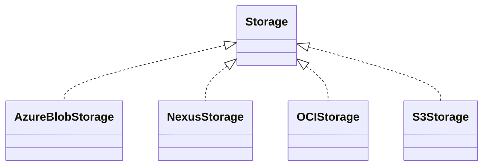
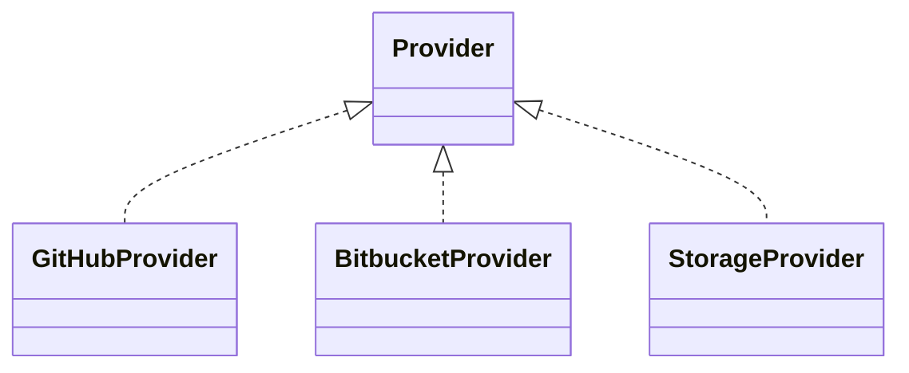
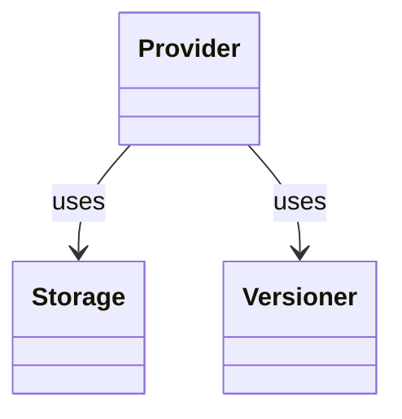
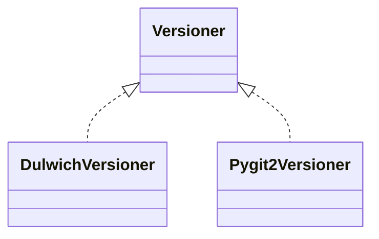
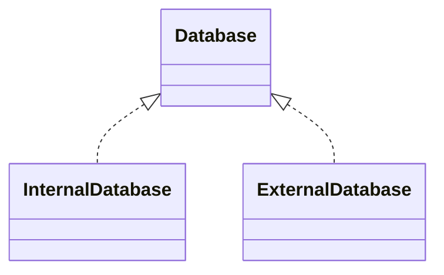
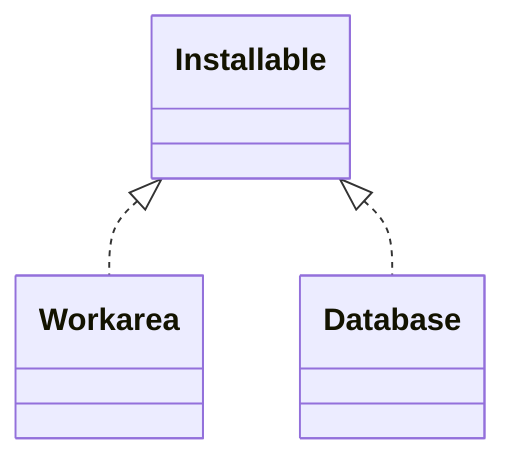
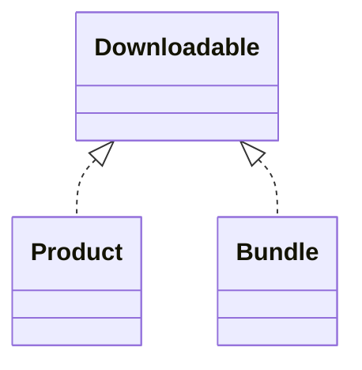
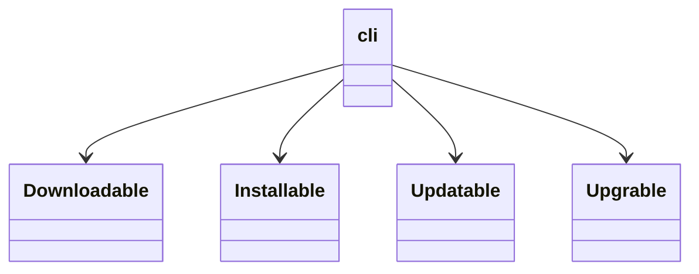

# CLAUDE.md

This file provides guidance to Claude Code (claude.ai/code) when working with code in this repository.

## Project overview

`kbot-installer` is a CLI tool (`kbot-installer` entry point, see `pyproject.toml`) for installing,
updating, and managing "kbot" products inside a local **workarea**. It fetches product sources from
git providers (GitHub, Bitbucket, Nexus) or object storage (S3, Azure Blob), tracks product
dependencies, and lays out/updates the resulting workspace on disk.

All actual Python source lives under `core/python/` (this is the package root — see
`pythonpath = ["core/python"]` in `pyproject.toml` and `PYTHONPATH` in `tox.ini`). Top-level packages
(`auth`, `backend`, `cli`, `credentials`, `database`, `errors`, `git`, `installable`,
`installer_support`, `interactivity`, `publisher`, `service`, `setup`, `storage`, `utils`, `workarea`,
`writer`) are imported as absolute imports, e.g. `from installable.base import InstallableBase`, not
`from core.python.installable...`.

## Common commands

Package management and running use `uv`; a `Makefile` wraps the common workflows (also exposed as
Claude commands in `.claude/commands/`, which run in French):

```bash
make install-dev        # uv sync --all-packages --all-groups --all-extras
make format              # ruff format .
make lint                # ruff check . (no fixes)
make lint-fix            # ruff check --fix .
make check                # format then lint
make test                # uv run python -B -m pytest -v
make test PKG=auth        # scope to one package, e.g. auth, backend, database, installable, workarea
make test PKG=auth/http_auth   # scope to a subpackage
make test-cov [PKG=...]   # same as test but with coverage (html + terminal)
make clean                # remove __pycache__, .pytest_cache, .coverage, htmlcov, .ruff_cache
```

Run a single test directly with pytest (pythonpath is already configured via `pyproject.toml`):

```bash
uv run python -B -m pytest core/python/database/tests/test_factory.py::test_add_db_internal -v
```

`tox` runs the full matrix (py310 and py312, each with `deps`/`lint`/`typecheck`/`test` envs) using
locked `uv` environments:

```bash
uvx tox                       # everything
uvx tox -e py312-test         # just the py312 test env
uvx tox -e py312-typecheck    # ty check core/python
uvx tox -e py312-lint         # ruff check + pylint --errors-only core/python
uvx tox -e py312-deps         # deptry . (unused/missing dependency check)
```

Type checking uses `ty` (see `[tool.ty]` in `pyproject.toml`); linting is `ruff check` (rules:
`select = ["ALL"]` with specific ignores in `ruff.toml`) plus `pylint --errors-only`. Tests, examples,
and a handful of legacy scripts (`kbot.py`, `nexus.py`, `setup_workarea.py`, `gitpassword.py`,
`deps.py`) are excluded from lint/typecheck — check `ruff.toml` and `pyproject.toml`
(`[tool.ty.src].exclude`, `[tool.deptry]`) before assuming a file should be clean.

## Architecture

### General overviw

#### Storage implementations


#### Code Provider implementations


#### Provider/Storage relationships


#### Versioner implementations


#### Database implementations


#### Installable implementations


#### Downloadable implementations





### Factory + naming-convention pattern (used pervasively)

Nearly every extensible subsystem (`auth`, `backend`, `credentials`, `database`, `git/provider`,
`git/versioner`, `installable`, `installable/updater`, `publisher`, `storage`, `writer`) follows the
same shape:

- `base.py` — an ABC defining the interface (e.g. `AuthBase`, `StorageBackend`, `DatabaseBackend`,
  `InstallableBase`, `UpdaterBase`).
- One module per concrete implementation, named `{name}_{package}.py` containing class `{Name}{Package}`
  — e.g. `s3_backend.py:S3Backend`, `github_provider.py:GithubProvider`, `strict_updater.py:StrictUpdater`.
- `factory.py` — a small `create_x(name, **kwargs)` / `add_x(name, **kwargs)` function that resolves
  the implementation dynamically by name using `utils/factory/factory.py`'s `factory_class` /
  `factory_object` / `factory_method`. These use `importlib` + the naming convention above to import
  `{package}.{name}_{package}` and instantiate `{Name}{Package}`, so **new implementations don't require
  registration** — just add the file following the naming convention.

When adding a new backend/provider/updater/etc., follow this convention exactly (module name and class
name are derived programmatically, not looked up in a registry) and add a corresponding `tests/`
package alongside it.

### Core domains

- **`git/provider`** — clone-only interface (`ProviderBase.clone`) for fetching product sources from
  GitHub, Bitbucket, Nexus, or storage-backed sources. `selector_provider.py` picks a provider based on
  config; `credential_manager.py` and `git/provider/config.py` resolve auth from env vars (see
  `core/python/env.example`) or the `credentials` package.
- **`git/versioner`** — full git operations (clone/add/pull/commit/push) via `dulwich`
  (`dulwich_versioner.py`), used where the installer needs to write back to a repo, not just fetch it.
- **`credentials`** — per-provider credential models (GitHub token, Bitbucket app password, S3, Azure
  storage, SSH, Nexus) resolved via `factory.py`.
- **`auth`** — HTTP auth strategies (API key, basic, bearer, login-refresh, SSH) shared by storage/service
  clients, combined via `auth_mixin.py`.
- **`backend`** / **`storage`** — object storage abstraction (S3, Azure Blob, Nexus) for storing/fetching
  bundled product archives; `storage/download_utils.py` and `service/nexus_*` implement the actual
  transfer logic.
- **`database`** — internal vs. external DB backend selection (`internal_db.py`, `external_db.py`) for
  wherever the installer needs persistent state.
- **`installable`** — the core domain model. `InstallableBase` defines the lifecycle
  (`load_from_installer_folder`, `to_xml`/`to_json`, `download`, `get_dependencies`, `install`,
  `update`, `upgrade`, `downgrade`, `repair`, `backup`/`restore`, `uninstall`/`delete`); most of these
  default to `raise NotImplementedError` and are opted into per-installable-type.
  - `ProductInstallable` — a single product, described by `description.xml` (+ optional JSON), with BFS
    dependency resolution (`dependency_graph.py`, `product_collection.py`).
  - `BundleInstallable` — a group/bundle of products (see root `bundle.py`).
  - `WorkareaInstallable` — installs/updates the whole `Workarea` (see `workarea/workarea.py`, a pydantic
    model of `installer_root`/`work_root`/`products`/`rules`) and delegates *how* an update is applied to
    the **updater strategy** (`installable/updater/`: `strict`, `smooth`, `repair`, `interactive`),
    selected via `installable/updater/factory.py:add_updater`.
- **`workarea`** — filesystem layout rules for the installed workspace; `workarea_rule.py` /
  `rule_action.py` apply rules from `conf/rules.json` (copy/symlink/etc. between namespaced products and
  the aggregated workarea).
- **`cli`** — Click-based CLI (`cli/commands.py`, entry point `cli/__main__.py:main`). Commands call into
  `installable.factory.create_installable(...)` and `installer_support.installer_service.InstallerService`
  rather than reimplementing logic; new subcommands should follow this pattern.
- **`installer_support`** — glue used by both the CLI and the installer runtime: env loading
  (`env_loader.py`, reads vars like those in `core/python/env.example`), logging setup
  (`logging_config.py`, configured from `logging.conf`), and `installer_service.py`/`installation_table.py`
  for tracking installed product state.

### Tests

Tests live in a `tests/` subpackage next to the code they cover (e.g. `database/tests/`,
`installable/updater/tests/`), mirroring the module being tested (`test_{module}.py`). A separate
`core/python/installer_tests/` covers `installer_support`. Coverage config lives in `.coveragerc`
(data file written to `/tmp/.coverage`, html to `/tmp/htmlcov`) and is loaded explicitly via
`pytest.ini`'s `addopts = --cov-config=.coveragerc` since `coverage.py` does not read `pytest.ini`.

## Docstrings

See "Google docstrings for generated code" below — this policy is enforced for all Python code
written or generated in this repo.

## Google docstrings for generated code

When writing or generating Python code, add docstrings in **Google format** (English).

### What to document

- **Modules**: one-line summary; add a short paragraph if the module role is not obvious.
- **Public classes and functions**: always document.
- **Private helpers** (`_name`): only when behavior is non-obvious.

Do not restate the signature in prose; use `Args`, `Returns`, and `Raises` instead.

### Format

```python
def clone_and_checkout(
    self,
    target_path: str | Path,
    branch: str | None = None,
) -> None:
    """Clone a repository and optionally checkout a branch.

    Args:
        target_path: Local path where the repository should be cloned.
        branch: Branch to checkout after cloning. If None, no checkout is performed.

    Raises:
        ProviderError: If the clone operation fails.

    """
```

```python
class Version:
    """Semantic version with major, minor, and patch components.

    Attributes:
        major: Major version number.
        minor: Minor version number.
        patch: Patch version number.

    """
```

### Rules

- Summary line: imperative mood, ends with a period.
- Blank line between summary and sections.
- Section order: `Args` → `Returns` → `Raises` → `Yields` (when applicable).
- Type hints live in the signature; docstrings describe meaning, not types (unless clarifying).
- Blank line after last section.
